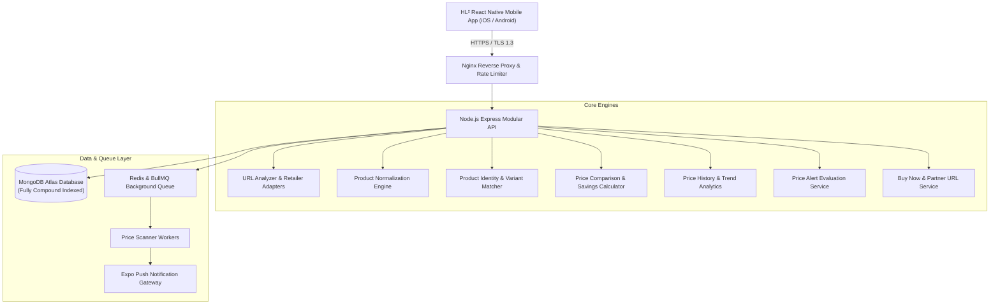
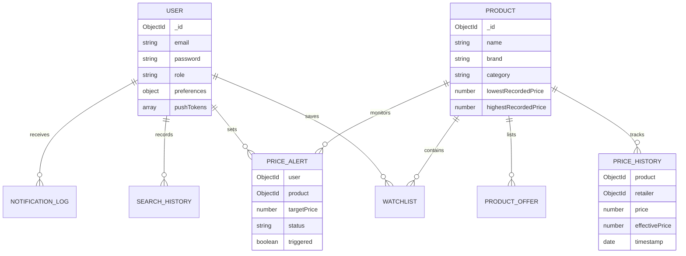

# HL²

> **Compare. Analyze. Buy Smarter.**

An enterprise-grade, full-stack price intelligence, cross-retailer comparison, and automated price-drop alert platform built with **React Native (TypeScript)**, **Node.js Express (JavaScript ES Modules)**, **MongoDB Atlas**, **Redis**, and **BullMQ**.

---

## 📖 Project Overview

**HL²** empowers shoppers to make confident, data-backed purchasing decisions. By pasting a single product link from supported e-commerce retailers (Amazon, Flipkart, Croma), HL² extracts product identifiers, audits real-time pricing across authorized stores, analyzes 180-day historical trends, and dispatches instant push notifications when prices drop below user-defined target thresholds.

---

## ✨ Features

- 🔍 **Real-Time Product URL Analyzer**: Automatically identifies retailer domains, cleans tracking noise (`utm_`, `ref_`, `fbclid`), and extracts direct product IDs (ASIN, PID, Product Code).
- 🏷️ **Multi-Store Price Comparison**: Real-time cross-store audit calculating lowest, highest, and average effective price, total cash savings, and discount percentages.
- 📈 **180-Day Price History & Trend Analytics**: Interactive historical pricing charts with moving averages and 7-day, 30-day, and 90-day price trend calculations.
- ⚡ **Automated Price Drop Alerts**: Set target thresholds (e.g., *"Notify me below ₹22,000"*) with background scanner queue evaluations.
- 📱 **Push Notification Engine**: Pluggable notification service (Expo Push Gateway) with automated deduplication logging to prevent notification spam.
- 🔖 **Watchlist & Search History Hub**: Privacy-conscious, LRU-capped (max 50 entries) user activity tracking with instant deletion and clearing controls.
- 🛒 **Authorized Buy Now Redirection**: Dynamic partner tag injection with strict protocol validation to prevent open-redirect phishing.
- 🛡️ **Comprehensive Security Hardening**: Bcrypt (12 rounds) salted hashing, strict JWT `HS256` verification, recursive NoSQL injection sanitizers, token-bucket rate limiting, and Helmet headers.

---

## 🏛️ Architecture



---

## 💻 Tech Stack

### Mobile Application
- **Framework**: React Native 0.76.7 with Expo SDK 52
- **Language**: TypeScript (`.tsx`, `.ts`)
- **Navigation**: React Navigation v7 (Native Stacks & Bottom Tabs)
- **UI & Styling**: Design Token Architecture (Glassmorphism, Dark Mode, Micro-interactions)
- **Icons**: Material Icons via Vector Icons

### Backend API & Workers
- **Runtime**: Node.js 20+ (ES Modules, `type: module`)
- **Framework**: Express 4.21.2
- **Database**: MongoDB 8.0+ via Mongoose 8.9.5
- **Task Queue & Caching**: Redis 7.0+ & BullMQ 6.3.4
- **Security & Crypto**: Bcrypt.js (12 salt rounds), JSONWebToken, Helmet 8.0
- **Testing**: Node.js native test runner with Strict Assertions

---

## 📂 Folder Structure

```text
HL2/
├── backend/                            # Node.js + Express + ES Modules API
│   ├── src/
│   │   ├── config/                     # Database connection & environment configuration
│   │   ├── controllers/                # Request controllers (auth, product, alert, etc.)
│   │   ├── errors/                     # Standardized AppError hierarchy & ERROR_CODES enum
│   │   ├── middleware/                 # Auth, rate limiting, NoSQL sanitizer, logging, errors
│   │   ├── models/                     # Mongoose schemas (User, Product, PriceHistory, etc.)
│   │   ├── providers/                  # Retailer adapter implementations (Amazon, Flipkart, Croma)
│   │   ├── routes/                     # Modular API route definitions
│   │   ├── scripts/                    # Database index synchronizer (ensureIndexes.js)
│   │   ├── services/                   # Business logic (normalizer, matcher, comparison, queue)
│   │   ├── utils/                      # Logger, password hashing, JWT helpers, response formatters
│   │   ├── workers/                    # BullMQ price scanner worker processes
│   │   ├── app.js                      # Express application assembly
│   │   └── server.js                   # HTTP server entry point & graceful shutdown
│   ├── test/                           # 15 automated test suites (89 tests)
│   ├── .env.example                    # Backend environment configuration template
│   └── package.json
│
├── mobile/                             # React Native Expo Mobile Client
│   ├── src/
│   │   ├── components/                 # Reusable UI components (Button, Card, OptimizedImage)
│   │   ├── context/                    # React Context providers (AuthContext)
│   │   ├── navigation/                 # Type-safe navigation stacks & coordinators
│   │   ├── screens/                    # Mobile screens (Home, Comparison, History, Watchlist, Profile)
│   │   ├── services/                   # Typed API clients (productApi.ts, notificationService.ts)
│   │   ├── theme/                      # Design system tokens (colors, typography, spacing, radii)
│   │   └── utils/                      # Client-side error translators & formatters
│   ├── App.tsx                         # Root mobile entry point
│   ├── app.json                        # Expo project configuration
│   └── package.json
│
├── docs/                               # Production & Operations Documentation
│   ├── production_configuration.md
│   ├── deployment_guide.md
│   ├── backup_strategy.md
│   ├── database_migration_and_indexing.md
│   ├── monitoring_and_observability.md
│   └── pre_launch_checklist.md
│
├── package.json                        # Monorepo root workspace configuration
└── README.md
```

---

## ⚙️ Installation & Setup

### 1. Prerequisites
- **Node.js**: `v20.x` or higher
- **npm**: `v9.x` or higher
- **MongoDB**: Local MongoDB instance (`mongodb://localhost:27017/hl2`) or MongoDB Atlas URI
- **Redis**: Local Redis instance on port `6379` (optional for local queue tests)

### 2. Clone and Install Dependencies
```bash
# Clone the repository
git clone https://github.com/your-username/hl2.git
cd hl2

# Install all monorepo dependencies
npm install
```

---

## 🔑 Environment Variables

### Backend Configuration (`backend/.env`)

Copy the example configuration file:
```bash
cp backend/.env.example backend/.env
```

| Variable | Default (Dev) | Description |
| :--- | :--- | :--- |
| `PORT` | `5001` | Backend listener port |
| `NODE_ENV` | `development` | Environment mode (`development` / `production`) |
| `MONGO_URI` | `mongodb://localhost:27017/hl2` | MongoDB connection string |
| `CORS_ORIGIN` | `*` | Allowed CORS origins |
| `JWT_SECRET` | `hl2_super_secret_jwt_key_2026_secure_tokens` | JWT signing secret |
| `JWT_EXPIRES_IN`| `7d` | User session duration |
| `BCRYPT_SALT_ROUNDS` | `12` | Password hash work factor |
| `REDIS_HOST` | `127.0.0.1` | BullMQ Redis broker host |
| `REDIS_PORT` | `6379` | BullMQ Redis broker port |
| `AFFILIATE_ENABLED` | `true` | Enable partner tag injection |
| `AFFILIATE_AMAZON_TAG` | `hl2app-21` | Amazon Associates tag |
| `AFFILIATE_FLIPKART_AFFID` | `hl2app` | Flipkart Affiliate ID |
| `AFFILIATE_CROMA_TAG` | `hl2_partner` | Croma partner campaign tag |

---

## 🚀 Running Locally

### Start Backend API
```bash
# From repository root:
npm run dev:backend

# Server starts on http://localhost:5001
```

### Start Mobile Application
```bash
# From repository root:
npm run dev:mobile
```
In the Expo terminal:
- Press `i` to launch in the **iOS Simulator**.
- Press `a` to launch in the **Android Emulator**.
- Press `w` to open in a **Web Browser**.
- Scan the QR code using the **Expo Go** app on physical iOS/Android devices.

---

## 📡 API Documentation

### 1. Product Intelligence Endpoints
- **`POST /api/products/analyze`**: Parses product URL, extracts identifier, returns deal score and normalized product specifications.
- **`POST /api/products/compare`**: Evaluates multiple retailer offers, calculating lowest, highest, average, savings, and availability.
- **`GET /api/products/:id/history?period=30D`**: Returns point-in-time pricing observations, moving statistics, and 7D/30D/90D percentage changes.
- **`POST /api/products/buy-now`**: Generates authorized destination/affiliate URL with tracking metadata and protocol validation.

### 2. User & Activity Endpoints
- **`POST /api/auth/register`**: Registers a new user account with bcrypt hashing and returns JWT token.
- **`POST /api/auth/login`**: Authenticates user credentials with brute-force rate limiting.
- **`GET /api/auth/me`**: Returns current authenticated user profile.
- **`GET /api/watchlist`**: Lists all products tracked by the user.
- **`POST /api/watchlist`**: Adds/updates a product on user's watchlist.
- **`DELETE /api/watchlist/:id`**: Removes a product from the watchlist.
- **`GET /api/alerts`**: Retrieves user's active price-drop alert thresholds.
- **`POST /api/alerts`**: Creates a price-drop alert.
- **`DELETE /api/alerts/:id`**: Deletes a price-drop alert.
- **`GET /api/search-history`**: Retrieves user's recent product searches (capped at 50 items).
- **`DELETE /api/search-history`**: Clears all user search history.

---

## 🗄️ Database Architecture

HL² uses Mongoose schemas with compound indexes covering sorting and filtering queries:



To build and verify production database indexes:
```bash
npm --prefix backend run db:index
```

---

## 🔌 Retailer Adapter Architecture

All merchant adapters implement the standardized `RetailerAdapter` interface:

```javascript
class RetailerAdapter {
  extractProductIdentifier(urlObj) {} // Extracts ASIN / PID
  normalizeUrl(urlObj) {}             // Generates clean canonical URL
  async getProduct(identifier) {}      // Fetches live product data
}
```

- **AmazonAdapter**: Extracts ASIN from `/dp/{ASIN}` and `/gp/product/{ASIN}`.
- **FlipkartAdapter**: Extracts PID / FSN from `/p/{PID}` and `?pid={PID}`.
- **CromaAdapter**: Extracts numeric Product Codes from `/p/{code}`.

---

## 🔍 Product Matching & Price Comparison

1. **Deterministic Identifier Matching**: Resolves exact matches using standard identifiers (ASIN, GTIN, MPN, SKU).
2. **Text Normalization & Fuzzy Scoring**: Normalizes brand, model, and technical specifications with token-based Jaccard similarity.
3. **Effective Price Calculation**: Compares final landed cost (`price + deliveryFee - couponDiscount`) without inventing unverified fees.
4. **Offer Status Classification**: Explicitly flags offers as `VERIFIED`, `STALE`, `ESTIMATED`, or `UNAVAILABLE`.

---

## 🔔 Price Alerts & Background Queue

- **BullMQ + Redis Engine**: Schedules periodic price scans for watched products.
- **Evaluation Rule**: Evaluates condition `currentPrice <= targetPrice`.
- **Deduplication**: `NotificationLog` records prevent duplicate push notifications for identical price-drop events.

---

## 🧪 Testing Strategy

HL² includes **15 automated test suites** covering **89 tests**:

```bash
# Run all backend test suites
npm run test:backend

# Run mobile TypeScript typecheck
npm run typecheck:mobile
```

### Test Suites Included:
1. `test/auth.test.js` (7 tests)
2. `test/urlAnalyzer.test.js` (5 tests)
3. `test/productNormalizer.test.js` (4 tests)
4. `test/productMatcher.test.js` (8 tests)
5. `test/priceComparison.test.js` (5 tests)
6. `test/priceHistory.test.js` (5 tests)
7. `test/watchlist.test.js` (5 tests)
8. `test/alert.test.js` (8 tests)
9. `test/priceQueue.test.js` (6 tests)
10. `test/notification.test.js` (7 tests)
11. `test/buyNow.test.js` (7 tests)
12. `test/searchHistory.test.js` (7 tests)
13. `test/errorHandling.test.js` (8 tests)
14. `test/securityAudit.test.js` (8 tests)
15. `test/performance.test.js` (5 tests)

---

## 🚢 Production Deployment

Detailed deployment and operations guides are provided in the `/docs` directory:

- 📘 [Production Configuration Guide](docs/production_configuration.md)
- 📘 [Deployment & Docker Runbook](docs/deployment_guide.md)
- 📘 [Disaster Recovery & Backup Strategy](docs/backup_strategy.md)
- 📘 [Database Migration & Indexing Guide](docs/database_migration_and_indexing.md)
- 📘 [Monitoring & Observability Guide](docs/monitoring_and_observability.md)
- 📘 [Pre-Launch Checklist](docs/pre_launch_checklist.md)

---

## 🔒 Security & Privacy

- **No Sensitive Leakage**: Passwords omitted in queries (`select: false`); stack traces suppressed in production API errors.
- **Strict JWT Verification**: Verifies tokens exclusively with `HS256` to prevent `none` algorithm token forgery.
- **NoSQL Injection Defense**: Recursive sanitization middleware removes `$` operators and dot notation.
- **Rate Limiting**: Throttles brute-force attempts on authentication and prevents scraping abuse on URL analysis.
- **Open Redirect Protection**: Validates external Buy Now destination URLs against protocol whitelists (`http:`, `https:` only).
- **Dependency Audit**: `npm audit` reports **0 vulnerabilities**.

---

## 🗺️ Future Improvements & Roadmap

- [ ] **Browser Extension**: Chrome Manifest V3 extension for 1-click price comparison on store pages.
- [ ] **Additional Retailers**: Expand adapters to Reliance Digital, Tata CLiQ, and Best Buy.
- [ ] **AI Deal Quality Prediction**: Deep-learning price forecasting predicting optimal buy days.
- [ ] **Barcode Scanner**: Mobile camera barcode scanning for in-store price comparisons.

---

## 🤝 Contribution Guidelines

1. **Fork the Repository** and create a feature branch (`git checkout -b feature/amazing-feature`).
2. **Adhere to Code Guidelines**:
   - Backend: Node.js ES Modules with JSDoc typing.
   - Mobile: React Native TypeScript with design tokens.
3. **Run Automated Tests**: Ensure all 15 test suites pass (`npm run test:backend`) and TypeScript compiles with zero errors (`npm run typecheck:mobile`).
4. **Submit a Pull Request** with clear descriptions and test evidence.

---

## 📄 License

UNLICENSED — Proprietary & Confidential. Copyright © 2026 HL² Team. All rights reserved.
