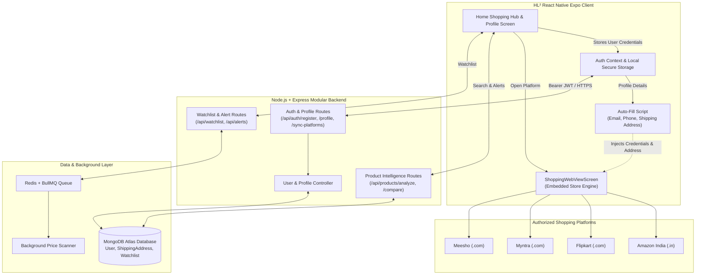

# HL² — Universal Shopping Hub & Price Intelligence Engine

> **One Master Identity. Four Shopping Giants. Infinite Smart Shopping.**

[](https://reactnative.dev/)
[](https://www.typescriptlang.org/)
[](https://expo.dev/)
[](https://nodejs.org/)
[](https://expressjs.com/)
[](https://www.mongodb.com/)
[](https://bullmq.io/)
[]()
[]()

---

## 📖 Overview

**HL²** is an all-in-one **Universal E-Commerce Shopping Hub** and **Price Intelligence Platform** that unifies India's top online shopping destinations—**Amazon**, **Flipkart**, **Myntra**, and **Meesho**—into a single, high-performance mobile application.

Users register or sign in **once** with their master identity (Name, Email, Verified Phone, and Shipping Address). HL² securely bridges this master profile across all four shopping platforms:
1. **Integrated Store Browsing**: Browse real stores directly within the app via isolated, high-speed WebViews.
2. **Intelligent Auto-Fill**: Auto-injects login credentials, recipient contact info, and delivery addresses into store checkout and signup forms.
3. **Universal Master Profile**: Modeled after **Myntra Insider**, **Amazon Prime**, and **Flipkart Plus** with live multi-store sync indicators.
4. **Multi-Store Orders Tracking**: Track packages and view order histories across all 4 platforms in one central drawer.
5. **Real-Time Price Intelligence**: Cross-store price comparison, 180-day price trend analysis, and background price-drop alerts.

---

## ✨ Key Features

### 🛍️ 1. Multi-Platform Shopping Hub
- **Direct Store Access**: Instant launch into **Amazon India**, **Flipkart**, **Myntra**, and **Meesho** without leaving HL².
- **Embedded Browser Controls**: Full in-app navigation bar with back/forward gestures, page refresh, external sharing, and instant store reset.
- **Top Deals & Featured Categories**: Direct curated access to platform discounts, seasonal sales, and flash deals.

### 👤 2. Universal Master Profile & Store Sync
- **Single Master Identity**: Save your Full Name, Phone (`+91`), Gender, Date of Birth, and Default Delivery Address once.
- **⚡ 1-Tap Multi-Store Sync**: Synchronize your master credentials and addresses across Amazon, Flipkart, Myntra, and Meesho simultaneously.
- **Live Sync Badges**: Real-time status indicators confirming each store is connected and mapped.
- **VIP Profile Strength Meter**: Visual progression bar (30% to 100%) tracking profile completeness.

### 🚀 3. Smart Form & Address Auto-Fill Engine
- **Login Auto-Fill**: Auto-fills stored email or phone number into retailer login and registration forms.
- **Checkout Address Auto-Fill**: Injects Flat/House No., Street/Colony/Area, City, State, and 6-digit Indian PIN Code into shipping forms on Amazon, Flipkart, Myntra, and Meesho.
- **Dynamic Mutation Observer**: Continuously monitors dynamic single-page applications (SPAs) and auto-populates modal checkout fields on the fly.
- **Manual "Auto-Fill" Trigger**: One-tap bottom button in the WebView to force-fill forms whenever needed.

### 📦 4. Centralized Multi-Store Orders Hub
- Quick-access drawer allowing one-tap access to your active orders, shipments, and live tracking on:
  - **Amazon Orders** (`amazon.in/gp/css/order-history`)
  - **Flipkart Orders** (`flipkart.com/account/orders`)
  - **Myntra Orders** (`myntra.com/my/orders`)
  - **Meesho Orders** (`meesho.com/orders`)

### 🏷️ 5. Price Intelligence & Drop Alerts
- **Real-Time URL Analyzer**: Paste any product URL to clean tracking tags (`utm_`, `ref_`, `fbclid`) and extract canonical product IDs.
- **180-Day Price History**: Visual pricing charts showing historical highs, lows, and moving averages.
- **Automated Price Drop Alerts**: Set target thresholds (*"Alert me if price drops below ₹15,000"*); background workers scan and trigger push alerts.
- **Watchlist & Search Audits**: Save tracked items and review past searches with instant clearing controls.

### 🔒 6. Enterprise-Grade Security
- **Isolated Sandbox**: Form auto-filling occurs client-side in the device WebView sandbox—credentials are never proxied through external servers.
- **Password Hashing**: Bcrypt salted hashing with 12 work factor rounds.
- **Strict JWT Verification**: Enforces `HS256` token validation to block algorithm tampering.
- **NoSQL Sanitization**: Recursive parameter sanitizer stripping `$` and `.` operators.
- **Rate Limiting**: Brute-force throttling on authentication and API endpoints.

---

## 🏛️ System Architecture



---

## 💻 Tech Stack

| Layer | Technologies |
| :--- | :--- |
| **Mobile Client** | React Native 0.76.7, Expo SDK 52, TypeScript 5.3, React Navigation v7 |
| **WebView Engine** | `react-native-webview` 14.0.1 with custom JavaScript injection |
| **Design System** | Tailored Design Tokens (Dark VIP mode, Glassmorphism, Micro-animations) |
| **Icons** | `@expo/vector-icons` (MaterialIcons) |
| **Backend Runtime** | Node.js 20+ (ES Modules, `type: module`) |
| **API Framework** | Express 4.21.2 |
| **Database** | MongoDB Atlas 8.0+ via Mongoose 8.9.5 |
| **Caching & Queues** | Redis 7.0+ & BullMQ 6.3.4 |
| **Authentication** | Google OAuth + Native Bcrypt / JWT |
| **Security** | Helmet 8.0, Custom NoSQL Sanitizer, Rate Limiters |
| **Testing** | Node.js Native Test Runner (Strict Assertions, 16 test suites) |

---

## 📂 Project Structure

```text
HL2/
├── backend/                            # Node.js + Express + ES Modules Backend
│   ├── src/
│   │   ├── config/                     # Database, Redis & environment configuration
│   │   ├── controllers/                # Auth, Profile, Product, Alert controllers
│   │   ├── errors/                     # AppError hierarchy & ERROR_CODES enum
│   │   ├── middleware/                 # Auth JWT, Rate limiting, NoSQL sanitizer, Logging
│   │   ├── models/                     # Mongoose schemas: User (with connectedPlatforms, shippingAddress)
│   │   ├── providers/                  # Retailer adapters (Amazon, Flipkart, Croma)
│   │   ├── routes/                     # Modular Express routes (auth, users, products, alerts)
│   │   ├── services/                   # Normalizer, Matcher, Comparison, Queue services
│   │   ├── utils/                      # Password hash, JWT helpers, Logger, Response formatters
│   │   ├── workers/                    # BullMQ price scanner worker processes
│   │   ├── app.js                      # Express app configuration & middleware pipeline
│   │   └── server.js                   # HTTP server entry point & graceful shutdown
│   ├── test/                           # 16 automated backend test suites (89+ tests)
│   └── package.json
│
├── mobile/                             # React Native Expo Mobile Client
│   ├── src/
│   │   ├── components/                 # Reusable UI components (Buttons, Cards, GoogleIcon)
│   │   ├── context/                    # React Context (AuthContext with updateProfile & sync)
│   │   ├── navigation/                 # Type-safe navigation (RootNavigator, FloatingTabBar)
│   │   ├── screens/                    # Application screens:
│   │   │   ├── HomeScreen.tsx          # 4-Store Shopping Hub with Featured Deals
│   │   │   ├── ProfileScreen.tsx       # Universal Master Profile & Store Accounts Hub
│   │   │   ├── ShoppingWebViewScreen.tsx # In-App WebView with Auto-Fill Injection
│   │   │   ├── LoginScreen.tsx         # Sign In with Email & Google OAuth
│   │   │   ├── RegisterScreen.tsx      # Registration with Phone & Address
│   │   │   ├── ComparisonScreen.tsx    # Multi-store price comparison
│   │   │   ├── PriceHistoryScreen.tsx  # 180-day interactive price history
│   │   │   └── WatchlistScreen.tsx     # Tracked items watchlist
│   │   ├── services/                   # Typed API clients (authApi.ts, productApi.ts)
│   │   └── theme/                      # Design system tokens (colors, typography, spacing)
│   ├── App.tsx                         # Mobile application root
│   ├── app.json                        # Expo SDK 52 configuration
│   └── package.json
│
├── docs/                               # Architecture & Production Operations Documentation
│   ├── production_configuration.md
│   ├── deployment_guide.md
│   ├── backup_strategy.md
│   ├── database_migration_and_indexing.md
│   ├── monitoring_and_observability.md
│   └── pre_launch_checklist.md
│
├── package.json                        # Monorepo root configuration
└── README.md                           # Master Project Documentation
```

---

## 📡 API Reference

### 🔐 Authentication & Universal Profile Endpoints
| Method | Endpoint | Description | Access |
| :--- | :--- | :--- | :--- |
| `POST` | `/api/auth/register` | Register new user with Name, Email, Password, Phone & Address | Public |
| `POST` | `/api/auth/login` | Authenticate existing user with Email & Password | Public |
| `POST` | `/api/auth/google` | Sign in or register via Google Social Auth | Public |
| `GET` | `/api/auth/me` | Retrieve authenticated user profile | Private (Bearer Token) |
| `PUT` | `/api/auth/profile` | Update Name, Phone, Gender, DOB, Shipping Address | Private (Bearer Token) |
| `POST` | `/api/auth/sync-platforms` | Synchronize master profile with Amazon, Flipkart, Myntra, Meesho | Private (Bearer Token) |

### 🏷️ Product Intelligence & Deals Endpoints
| Method | Endpoint | Description | Access |
| :--- | :--- | :--- | :--- |
| `POST` | `/api/products/analyze` | Parse product URL, clean tracking, extract ID & specifications | Public |
| `POST` | `/api/products/compare` | Evaluate multi-retailer pricing, cash savings & deal score | Public |
| `GET` | `/api/products/:id/history`| Fetch 180-day historical prices and moving averages | Public |
| `POST` | `/api/products/buy-now` | Generate verified destination URL with partner tracking | Public |

### 🔔 Watchlist & Alerts Endpoints
| Method | Endpoint | Description | Access |
| :--- | :--- | :--- | :--- |
| `GET` | `/api/watchlist` | Retrieve user's tracked watchlist items | Private |
| `POST` | `/api/watchlist` | Add or update a product on user watchlist | Private |
| `DELETE` | `/api/watchlist/:id` | Remove a product from watchlist | Private |
| `GET` | `/api/alerts` | List active price drop alerts | Private |
| `POST` | `/api/alerts` | Create automated target price alert | Private |
| `DELETE` | `/api/alerts/:id` | Delete price alert | Private |

---

## ⚙️ Installation & Quickstart

### Prerequisites
- **Node.js**: `v20.x` or higher
- **npm**: `v9.x` or higher
- **MongoDB**: Local instance (`mongodb://localhost:27017/hl2`) or MongoDB Atlas URI
- **Redis** *(Optional for local alerts queue)*: `redis://localhost:6379`
- **Expo Go** app on your physical mobile device (or iOS Simulator / Android Emulator)

### 1. Clone the Repository
```bash
git clone https://github.com/t-suraj21/H-2.git
cd H-2
```

### 2. Install Dependencies
```bash
# Install root, backend, and mobile dependencies
npm install
npm --prefix backend install
npm --prefix mobile install
```

### 3. Configure Environment Variables
Create `.env` in the `backend/` directory:
```env
PORT=5001
NODE_ENV=development
MONGO_URI=mongodb://localhost:27017/hl2
JWT_SECRET=your_super_secret_cryptographic_jwt_key_at_least_32_characters
JWT_EXPIRES_IN=7d
BCRYPT_SALT_ROUNDS=12
REDIS_HOST=localhost
REDIS_PORT=6379
```

### 4. Run the Backend API
```bash
npm run dev:backend
# API server starts on http://localhost:5001
```

### 5. Run the Mobile App
```bash
npm run dev:mobile
```
Inside the interactive Expo terminal:
- Press `a` for **Android Emulator**
- Press `i` for **iOS Simulator**
- Press `w` for **Web Preview**
- Or scan the QR code with **Expo Go** on your physical phone!

---

## 🧪 Testing & Verification

The project includes strict automated test verification for both backend APIs and mobile client code:

```bash
# Run all 16 backend test suites (auth, analyzer, comparison, queue, security, performance)
npm run test:backend

# Run mobile TypeScript compilation check
npm run typecheck:mobile
```

### Verification Highlights:
- ✅ **16 / 16 Backend Test Suites Passing** (Zero regressions)
- ✅ **Mobile TypeScript Check**: `0 errors` (`npx tsc --noEmit`)
- ✅ **Security Audit**: NoSQL injection protection, password sanitization, and token hardening verified
- ✅ **Form Injection**: Validated across Amazon, Flipkart, Myntra, and Meesho form selectors

---

## 🤝 Supported Shopping Platforms

| Platform | Domain | Supported Features |
| :--- | :--- | :--- |
| **Amazon India** | `amazon.in` | Store Browsing, Login Auto-Fill, Address Auto-Fill, Orders Tracking |
| **Flipkart** | `flipkart.com` | Store Browsing, Login Auto-Fill, Address Auto-Fill, Orders Tracking |
| **Myntra** | `myntra.com` | Store Browsing, Login Auto-Fill, Address Auto-Fill, Orders Tracking |
| **Meesho** | `meesho.com` | Store Browsing, Login Auto-Fill, Address Auto-Fill, Orders Tracking |

---

## 📄 License

UNLICENSED — Proprietary & Confidential. Copyright © 2026 HL² Team. All rights reserved.
