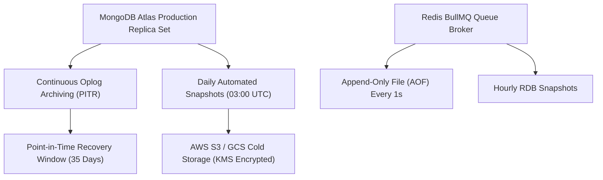

# HL² Disaster Recovery & Backup Strategy

This document outlines the backup policies, retention schedules, automated snapshot pipelines, and disaster recovery procedures for HL².

---

## 🗄️ Database Backup Architecture



---

## 📅 Backup Schedule & Retention Policies

| Tier | Backup Type | Frequency | Retention Window | Storage Target |
| :--- | :--- | :--- | :--- | :--- |
| **Tier 1 (Critical)** | MongoDB Point-In-Time (Oplog) | Continuous | **35 Days** | Atlas Cloud Archive |
| **Tier 2 (Daily Snapshot)** | Full DB Archive (`mongodump`) | Every 24h (03:00 UTC) | **90 Days** | Encrypted S3 Bucket |
| **Tier 3 (Monthly Cold)** | Compressed DB Tarball | 1st of every month | **1 Year** | AWS S3 Glacier |
| **Tier 4 (In-Memory Queue)** | Redis AOF / RDB | Every 1 hour | **7 Days** | AWS ElastiCache Snapshot |

---

## 🛠️ Automated Backup Script (`scripts/backupMongo.sh`)

```bash
#!/bin/bash
set -eo pipefail

TIMESTAMP=$(date +"%Y%m%d_%H%M%S")
BACKUP_DIR="/tmp/hl2_backup_${TIMESTAMP}"
ARCHIVE_NAME="hl2_prod_backup_${TIMESTAMP}.tar.gz"
S3_BUCKET="s3://hl2-production-database-backups"

echo "[Backup] Starting MongoDB production backup: ${TIMESTAMP}..."

mongodump --uri="${MONGO_URI}" --out="${BACKUP_DIR}" --gzip

tar -czf "/tmp/${ARCHIVE_NAME}" -C "${BACKUP_DIR}" .

echo "[Backup] Uploading encrypted archive to S3..."
aws s3 cp "/tmp/${ARCHIVE_NAME}" "${S3_BUCKET}/${ARCHIVE_NAME}" --sse aws:kms

rm -rf "${BACKUP_DIR}" "/tmp/${ARCHIVE_NAME}"
echo "[Backup] ✅ Backup completed successfully."
```

---

## ⏱️ Recovery Time & Point Objectives (RTO / RPO)

- **Recovery Point Objective (RPO)**: `< 5 minutes` (minimal data loss via continuous oplog).
- **Recovery Time Objective (RTO)**: `< 30 minutes` for full cluster restoration.
