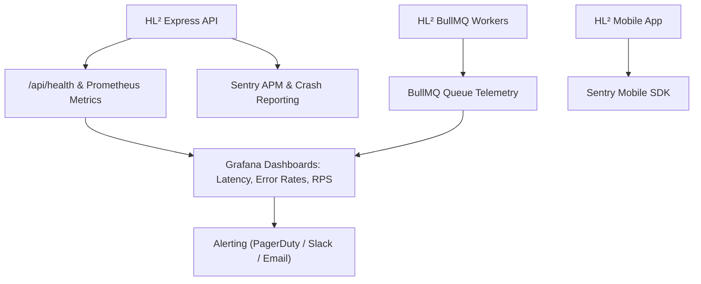

# HL² Monitoring & Observability Recommendations

This document outlines the monitoring stack, alerting thresholds, Application Performance Monitoring (APM), and logging architectures for production.

---

## 📈 Observability Architecture

---

## 🚨 Production Alert Thresholds

| Metric | Warning Threshold | Critical Threshold | Action Required |
| :--- | :--- | :--- | :--- |
| **API Error Rate (5xx)** | `> 1% of total requests` | `> 3% of total requests` | Trigger on-call pager; inspect Sentry |
| **P95 Response Latency** | `> 300ms` | `> 800ms` | Investigate slow queries / DB connections |
| **BullMQ Failed Jobs** | `> 5 jobs / 10 mins` | `> 25 jobs / 10 mins` | Inspect retailer adapter network status |
| **Redis Memory Utilization** | `> 75% max memory` | `> 90% max memory` | Scale Redis cluster node instance |
| **MongoDB CPU Utilization**| `> 70% CPU` | `> 85% CPU` | Review query explain plans & slow queries |
| **Disk Space Usage** | `> 80% capacity` | `> 90% capacity` | Expand EBS / storage volume |

---

## 🔍 Recommended Tools & Services

1. **APM & Error Tracing**: [Sentry](https://sentry.io) for real-time frontend and backend exception tracking.
2. **Metrics & Dashboards**: Prometheus + Grafana (or Datadog) for Node.js event loop latency, memory, and HTTP status codes.
3. **Queue Monitoring**: Bull Board (`@bull-board/express`) for real-time visual inspection of BullMQ queue state.
4. **Health Check Probes**: UptimeRobot or AWS Route 53 Health Checks monitoring `GET https://api.hl2.app/api/health` every 60 seconds.
