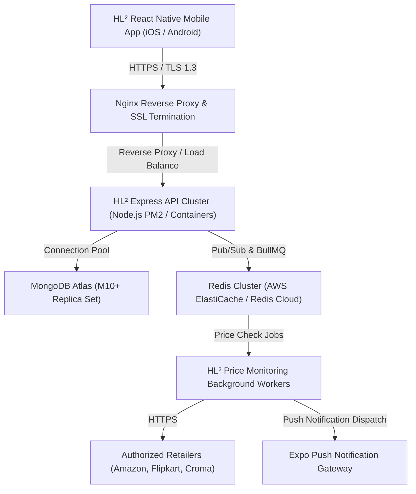

# HL² Production Configuration Guide

This document defines the production configuration requirements, environment specifications, and security policies for deploying HL² to live environments.

---

## 🏗️ Architecture Overview

---

## ⚙️ Environment Variables Specification

| Variable | Type | Required | Production Value / Format | Purpose |
| :--- | :--- | :---: | :--- | :--- |
| `NODE_ENV` | String | **Yes** | `production` | Enables production optimizations & disables dev debug dumps |
| `PORT` | Number | **Yes** | `5001` or `8080` | Internal application listener port |
| `MONGO_URI` | URI | **Yes** | `mongodb+srv://...` | MongoDB connection string with TLS & replica set |
| `CORS_ORIGIN` | String | **Yes** | `https://hl2.app,https://admin.hl2.app` | Restricts cross-origin resource sharing |
| `JWT_SECRET` | String | **Yes** | 64-character random hex string | Signs user authentication tokens securely |
| `JWT_EXPIRES_IN` | String | **Yes** | `7d` | Session token lifetime |
| `BCRYPT_SALT_ROUNDS`| Number | **Yes** | `12` | Cryptographic work factor for password hashing |
| `REDIS_HOST` | String | **Yes** | VPC internal IP / DNS | BullMQ queue broker host |
| `REDIS_PORT` | Number | **Yes** | `6379` | BullMQ queue broker port |
| `REDIS_PASSWORD` | String | **Yes** | Strong auth string | Redis access authentication |
| `AFFILIATE_ENABLED`| Boolean| **Yes** | `true` | Enables partner monetization tag injection |
| `AFFILIATE_AMAZON_TAG` | String | **Yes** | Real Associates Tag | Amazon Associates partner identifier |
| `AFFILIATE_FLIPKART_AFFID` | String | **Yes** | Real Affiliate ID | Flipkart Affiliate partner ID |
| `AFFILIATE_CROMA_TAG` | String | **Yes** | Real Partner Tag | Croma Affiliate partner tracking parameter |
| `NOTIFICATION_PROVIDER` | String | **Yes** | `expo` | Production push notification provider |

---

## 🔒 Security Requirements for Production

1. **Secret Management**:
   - Never store unencrypted `.env` files in git repositories.
   - Use AWS Secrets Manager, HashiCorp Vault, or Google Cloud Secret Manager to inject environment secrets into container runtime.

2. **TLS / SSL Termination**:
   - Enforce HTTPS exclusively with TLS 1.3.
   - Configure HSTS (`Strict-Transport-Security: max-age=63072000; includeSubDomains; preload`).

3. **Database Connection Hardening**:
   - Enforce SSL/TLS connections (`ssl=true`).
   - Limit MongoDB IP access list strictly to backend cluster VPC CIDR blocks.
